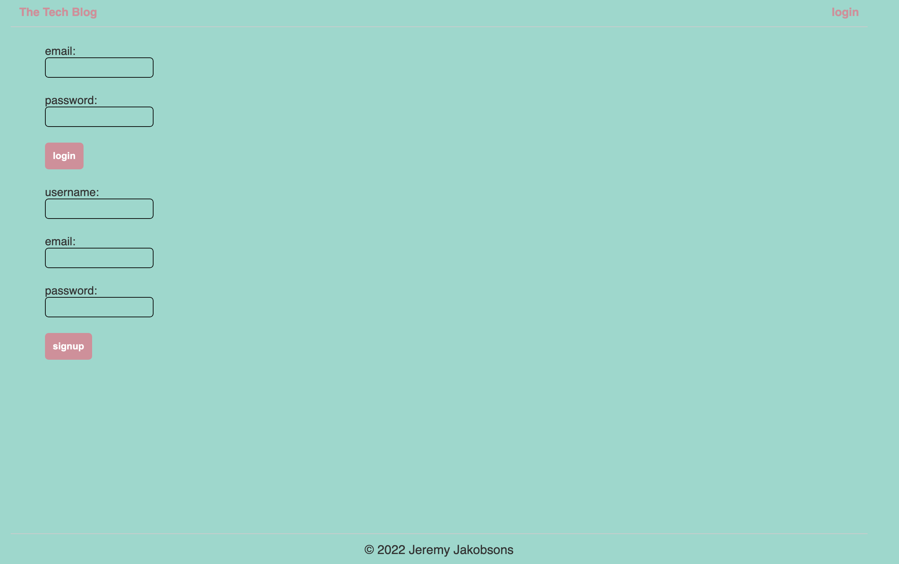

# techBlog

  ## Table-Of-Contents 

  * [Description](#description)
  * [Installation](#installation)
  * [Usage](#usage)
  * [License](#license)
  * [Contributing](#contributing)
  * [ScreenShot](#screenshot)
  * [Questions](#questions)

  ## Description

  This is a blog web application that has users that can sign-up, login, logout, create posts, and comment on them! 

  ## Installation

  To install this code, first clone the repo. Then install the npm packages listed in the contribution section below by performing 'npm i'. You will also want an application similar to Insomnia to test the endpoints/routes. You will want to make sure you have MySql installed. 

  ## Usage

  Once installed, you should be able to start the server using the "npm start" command. Then navigate to the local host  

  ## License

  This project is covered under the following license: 
  MIT

  ## Contributing 
  NPM Packages used: 
  Node, MySQL2, express

  ## ScreenShot

  ## Questions 

  Any questions? Reach out to me via GitHub or Email!  
  [Github](https://github.com/jjakobsons87)  
  [Email](mailto:jjakobsons87@gmail.com)